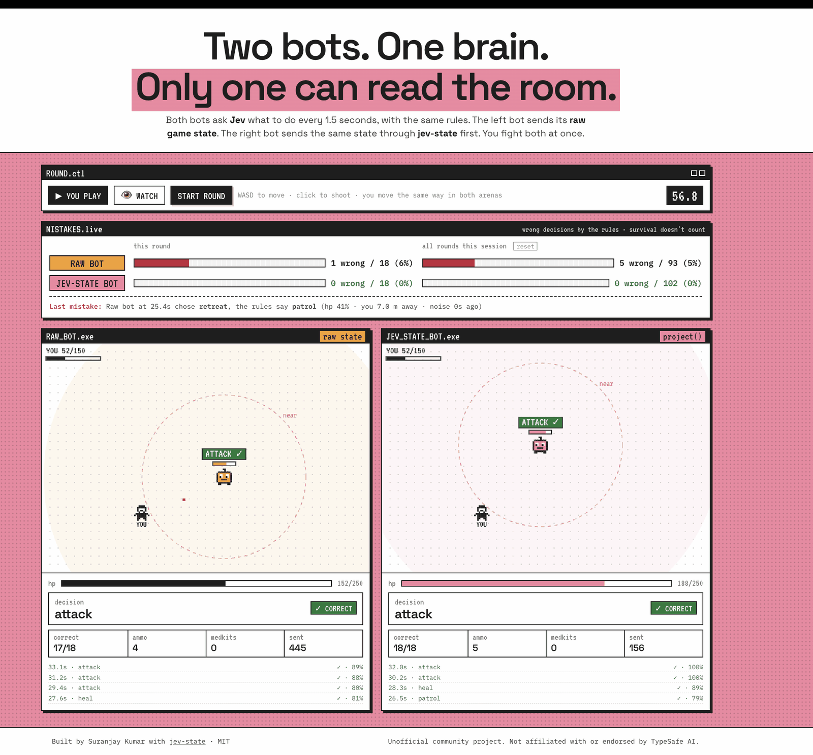
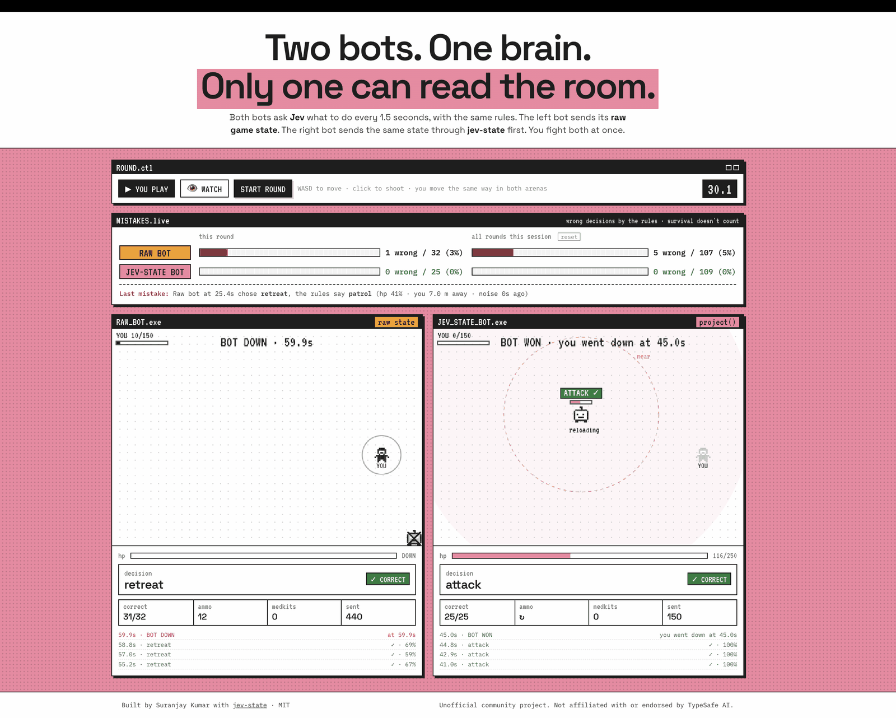
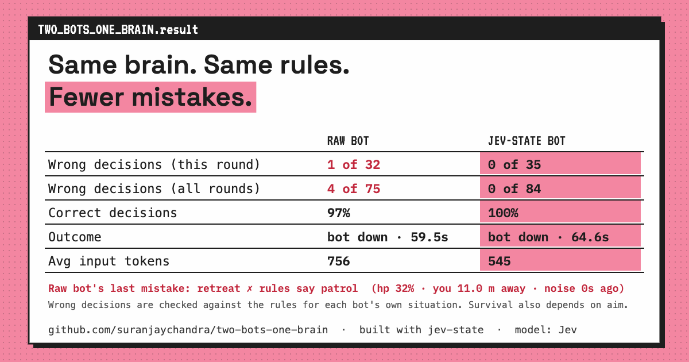

# Two Bots, One Brain

**Built with [jev-state](https://github.com/suranjaychandra/jev-state)** ([npm](https://www.npmjs.com/package/jev-state)), an open-source library that turns raw app and game state into state Jev reads well.

Two game bots share one brain: [Jev](https://typesafe.ai), TypeSafe AI's decision model. Every 1.5 seconds each bot asks Jev what to do, with the same rules and the same question. The only difference is what each bot sends:

- **Raw bot:** its raw game state: `hp: 38, maxHp: 250`, exact distances, epoch timestamps, positions, and debug data.
- **jev-state bot:** the same state after [jev-state](https://www.npmjs.com/package/jev-state): `hp: "critical"`, `distance: "near"`, `lastNoiseAt: "just now"`.

You fight both at once in two mirrored arenas. Every decision is checked against the rules, so you can see which bot reads the situation correctly.



## Run it

You need Node.js 22+.

```sh
git clone https://github.com/suranjaychandra/two-bots-one-brain.git
cd two-bots-one-brain
npm install
```

**With Jev** (needs a [TypeSafe](https://typesafe.ai) API key):

```sh
cp .env.example .env     # paste your TYPESAFE_API_KEY and save
npm start                # http://localhost:3001
```

**Without a key:**

```sh
npm run offline          # both bots use the local rules instead of Jev
```

Open http://localhost:3001, choose **YOU PLAY** (WASD to move, click to shoot) or **WATCH** (a scripted player), then press **START ROUND**. Every decision is also printed in the terminal.

The **MISTAKES.live** bar above the arenas counts each bot's wrong decisions by the rules, for this round and for every round since the page loaded. Survival doesn't affect it.

## What it looks like in real play

These screenshots are from real rounds against the live Jev API, with the same rules for both bots.

In this session, the **raw bot made 5 wrong decisions out of 107**. The **jev-state bot made 0 out of 109**. Each answer is checked against the rules for that bot's own situation.



After a round you can download a result card to share:



This is a handful of rounds, not a benchmark. For a reproducible benchmark (420 calls, seeded scenarios), see [jev-state](https://github.com/suranjaychandra/jev-state#benchmark).

## How it works

| File | What it does |
|---|---|
| `brain.ts` | The rules Jev is given, the raw state, the jev-state schema, and the correct answer by the rules |
| `server.ts` | Receives each bot's numbers, builds its state, and asks Jev. The API key stays here. |
| `public/game.js` | The arenas, the bots, and the round. You move the same way in both arenas. |

The bots choose between five actions: **retreat**, **heal**, **attack**, **investigate**, and **patrol**. A minute of play makes about 80 Jev calls, roughly $0.003.

## Keeping it fair

- **Same everything except the state.** Both bots get the same rules, the same question, the same model, and the same starting position. You move the same way in both arenas.
- **Same aim.** The bots end up in different places, so a click aims at each arena's own bot when it's close to where you clicked. One click is equally accurate in both arenas.
- **Each arena has its own fight.** You have 150 hp in each arena, and bullets travel 16–18 m, so retreating out of range actually saves a bot.
- **Correct decisions is the fair score.** Each answer is checked against the rules for that bot's own situation. Who wins a round also depends on aim and positioning, so compare outcomes over several rounds rather than one.

## License

[MIT](LICENSE) © 2026 Suranjay Kumar

Unofficial community project. Not affiliated with or endorsed by TypeSafe AI.

## Related

- [jev-state](https://github.com/suranjaychandra/jev-state): the library behind the jev-state bot, with a reproducible benchmark and a playground.
